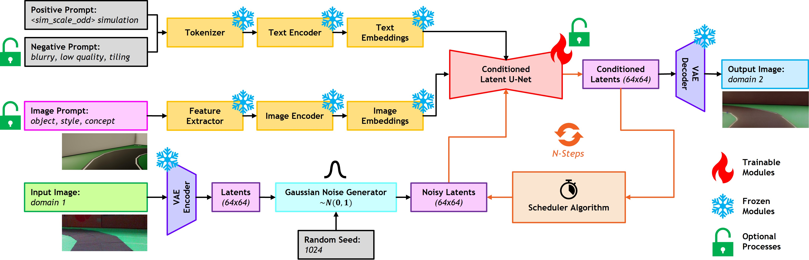
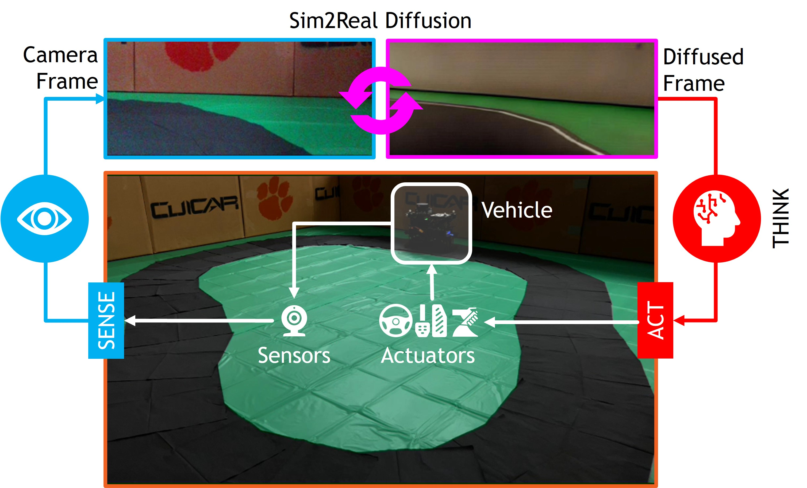

# Sim2Real Diffusion: Learning Cross-Domain Adaptive Representations for Transferable Autonomous Driving

  Simulation-based design, optimization, and validation of autonomous driving algorithms have proven to be crucial for their iterative improvement over the years. Nevertheless, the ultimate measure of effectiveness is their successful transition from simulation to reality (sim2real). However, existing sim2real transfer methods struggle to comprehensively address the autonomy-oriented requirements of balancing: (i) conditioned domain adaptation, (ii) robust performance with limited examples, (iii) modularity in handling multiple domain representations, and (iv) real-time performance. To alleviate these pain points, we present a unified framework for learning cross-domain adaptive representations for sim2real transferable autonomous driving algorithms using conditional latent diffusion models. Our framework offers options to leverage: (i) alternate foundation models, (ii) a few-shot fine-tuning pipeline, and (iii) textual as well as image prompts for mapping across given source and target domains. It is also capable of generating diverse high-quality samples when diffusing across parameter spaces such as times of day, weather conditions, seasons, and operational design domains. We systematically analyze the presented framework and report our findings in the form of critical quantitative metrics and ablation studies, as well as insightful qualitative examples and remarks. Additionally, we demonstrate the serviceability of the proposed approach in bridging the sim2real gap for end-to-end autonomous driving using a behavioral cloning case study. Our experiments indicate that the proposed framework is capable of bridging the perceptual sim2real gap by over 40\%. We hope that our approach underscores the potential of generative diffusion models in sim2real transfer, offering a pathway toward more robust and adaptive autonomous driving.

