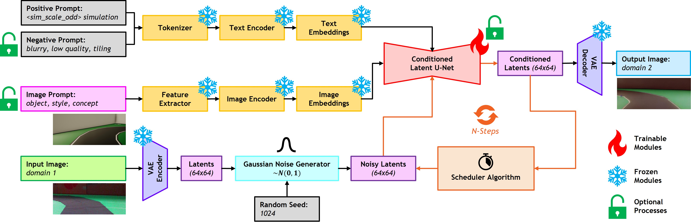
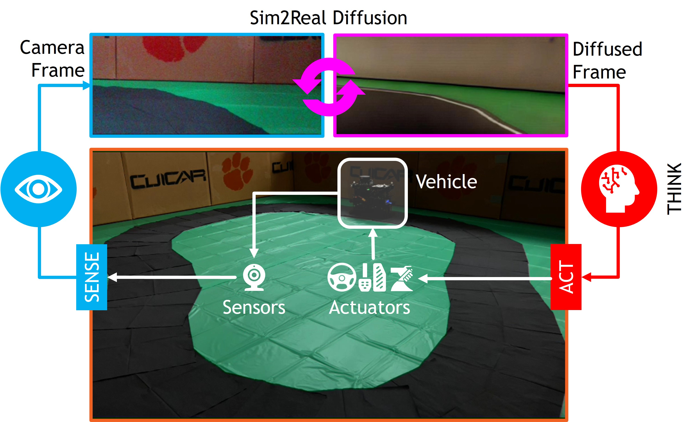

# Sim2Real Diffusion: Learning Cross-Domain Adaptive Representations for Transferable Autonomous Driving

[](https://doi.org/10.5281/zenodo.17934254)



## Abstract:

<p align="justify">
Simulation-based design, optimization, and validation of autonomous vehicles have proven to be crucial for their improvement over the years. Nevertheless, the ultimate measure of effectiveness is their successful transition from simulation to reality (sim2real). However, existing sim2real transfer methods struggle to address the autonomy-oriented requirements of balancing: (i) conditioned domain adaptation, (ii) robust performance with limited examples, (iii) modularity in handling multiple domain representations, and (iv) real-time performance. To alleviate these pain points, we present a unified framework for learning cross-domain adaptive representations through conditional latent diffusion for sim2real transferable automated driving. Our framework offers options to leverage: (i) alternate foundation models, (ii) a few-shot fine-tuning pipeline, and (iii) textual as well as image prompts for mapping across given source and target domains. It is also capable of generating diverse high-quality samples when diffusing across parameter spaces such as times of day, weather conditions, seasons, and operational design domains. We systematically analyze the presented framework and report our findings in terms of performance benchmarks and ablation studies. Additionally, we demonstrate its serviceability for autonomous driving using behavioral cloning case studies. Our experiments indicate that the proposed framework is capable of bridging the perceptual sim2real gap by over 40%.
</p>



## Citation:

We encourage you to read and cite the following paper if you use any part of this work for your research:

#### [Sim2Real Diffusion: Learning Cross-Domain Adaptive Representations for Transferable Autonomous Driving](https://arxiv.org/abs/2507.00236)
```bibtex
@article{Sim2Real-Diffusion-2026,
author = {Samak, Chinmay and Samak, Tanmay and Li, Bing and Krovi, Venkat},
journal = {IEEE Robotics and Automation Letters}, 
title = {Sim2Real Diffusion: Leveraging Foundation Vision Language Models for Adaptive Automated Driving}, 
year = {2026},
volume = {11},
number = {1},
pages = {177-184},
doi={10.1109/LRA.2025.3632723}
}
```

This work has been published in **IEEE Robotics and Automation Letters.** The publication can be found on [IEEE Xplore](https://doi.org/10.1109/LRA.2025.3632723).
